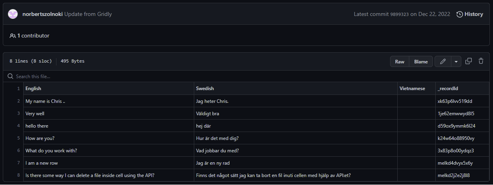
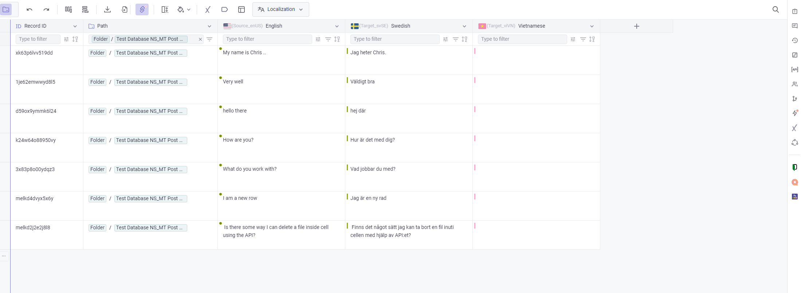
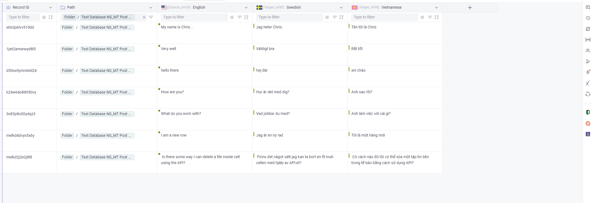
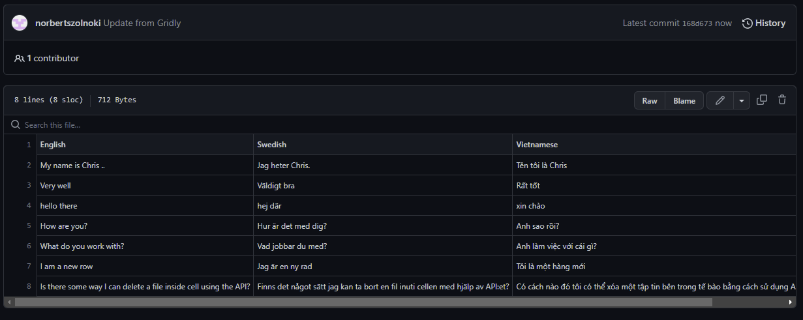
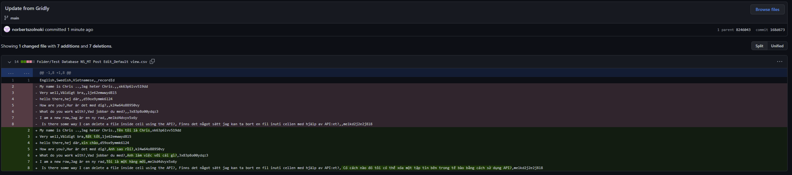
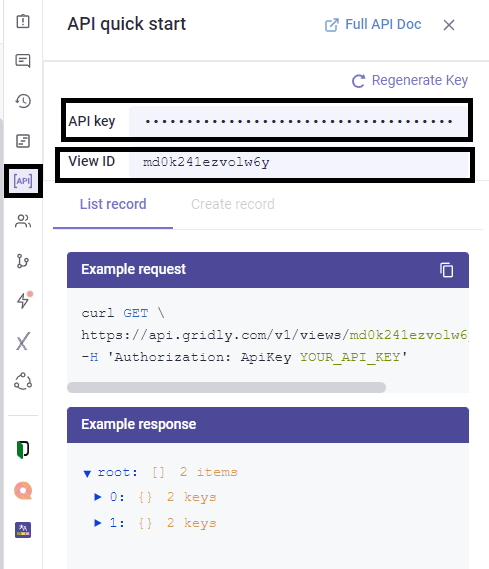

# Building a localization workflow using GitHub

Multilingual CSV files are commonly used by developers to store and transfer translation content to LSPs. Since so much of the development environment is automated or semi-automated, why not automate the CSV transfer process as well? In this tutorial, you’ll learn how to implement a CSV file import/export integration between Gridly and GitHub, using an AWS Lambda script executed straight from Gridly.

## Automation Localization
**02-21-2023** - Norbert Szolnoki

# Building a localization workflow using GitHub

## Workflow steps for a localization workflow using GitHub

1. **Empty source strings stored in a CSV file on GitHub**


2. **Importing empty strings into Gridly via a Gridly automation**


3. **Localization is performed in Gridly or in a connected platform such as like memoQ or Phrase**


4. **Gridly automatically updates the source file on GitHub**


5. **The commit of the source file update**


## Implementing the integration

While this tutorial uses Python as an example, you can use any coding language with Gridly’s API.

### Importing data from GitHub into Gridly

1. **Find the files on GitHub**

   To find the CSV files on GitHub, use the tree call of a branch to return all files in all subfolders. Filter the results by files ending with .csv.

2. **Identify the file contents**

   Use the `download_url` value of the file to obtain its content.

3. **Store the file path**

   Gridly uses a tree system called Paths to store files in a hierarchy. Create a new column in the file content from the last step and add the Path variable of the file to every row. When we push the updated file back to GitHub, we’ll know the exact location of each file.

4. **Create columns in Gridly for file headers**

   To parse your CSV, create columns in Gridly that match your columns in the CSV. By default, Gridly creates multiple-line columns with the name and ID of your CSV column. Edit the Gridly columns as needed — for example, change the column type to Localization and select a language. This has no effect on the integration with GitHub and only serves to make content easier to find in Gridly.

5. **Upload the file into your Grid**

   CSV file import is one of the many calls you can perform with Gridly’s rich API, which can handle any action also permitted within the Gridly UI.


# Push Translated Files Back into GitHub

## Export Grid as CSV from Gridly

Export the whole Grid from Gridly in CSV format via the Gridly API export endpoint.

## Split Files by Path

Split the Grid data by Path to organize files as needed.

## Get the File SHA on GitHub

The original file SHA is needed for the commit call. In this tutorial, we’re using a function that requires the file path to retrieve the data object of the file from GitHub. Then, we can use the returned data to commit the updated data.

## Delete Unnecessary Headers from the CSV

Since the Path column isn’t present in the original file, remove it from the data collection committing to GitHub.

## Commit the Updated and Cleaned Data

In the response body, provide the SHA of the original file and the content decoded as byte64 in UTF-8 format.

# Authorization

## GitHub

GitHub requires an API key to get and set data. In our examples, we’ve used the `github_token` variable to store that token. Here’s how to obtain your GitHub token:

1. On GitHub, click your avatar in the top-right corner and select Settings.
2. In the left sidebar, click Developer settings.
3. Click on Personal access tokens.
4. Click Generate new token.
5. Give your token a descriptive name, select its scopes (permissions), then click Generate token. Select the repo option to give permission for your private and public repositories.

Treat your API token like a password, as it allows access to your GitHub account and data. Grant only the minimum permissions necessary for the desired task.

## Gridly

To use the Gridly Rest API, open the Grid that you’ll use for the connection. In the API section, you’ll find `viewID` and API key for your Grid.

# Set up AWS Lambda functions in Gridly

As seen in the code examples, base calls initiate the whole process in both directions. The arguments of these base calls are `event` and `context`. The Gridly lambda script places the payload into the `event` argument.

# How to create an automation in Gridly

1. Open your Grid and click the lightning-bolt Automations icon on the right side.
2. Click Add automation.
3. Name your automation.
4. Click Add Trigger.
5. Select the Trigger button clicked from the list.
6. Click Add Step.
7. Click Lambda Function.
8. Click Add Function.
9. Browse the ZIP file that contains the script.
10. Fill the form with the required data. Set the Handler name as the name of the function. In the sample code in this tutorial, the handler name is `get_files_from_github`.
11. Click Add.

Create a JSON payload in the payload section with the following data:

```json
{
    "gridly_api_key": "",
    "view_id": "",
    "github_owner": "",
    "github_repo": "",
    "github_branch": "",
    "github_token": ""
}
```

The gridly_api_key and view_id can be found in Gridly in the API Quickstart:



The `github_owner` and `github_repo` can be found in the link of your GitHub repository. Consider the following repo link: [https://github.com/norbertszolnoki/gridly-github-integration-testfiles](https://github.com/norbertszolnoki/gridly-github-integration-testfiles). Here, `norbertszolnoki` is the owner and `gridly-github-integration-testfiles` is the repository.

The `github_branch` is a branch you would like to pull. Select `main`; every repo has a `main` when they are created. For the `github_token`, refer to the [Authorization/GitHub section](#authorization) of this tutorial.

Pushing the data back into GitHub uses the same payload. Enter `commit_files_to_github` for the Handler name when creating the action.

## Expanding this script

If you have images or voice-overs in your GitHub repository, you can pull them into Gridly as well. Add an extra payload item that tells the script the header of the column containing the name of those files, and another payload item with the path of the files. Then, add a function that gets the files after the CSV import and adds them to the Grid: [Gridly API - Upload File](https://www.gridly.com/docs/api/#upload-file).
